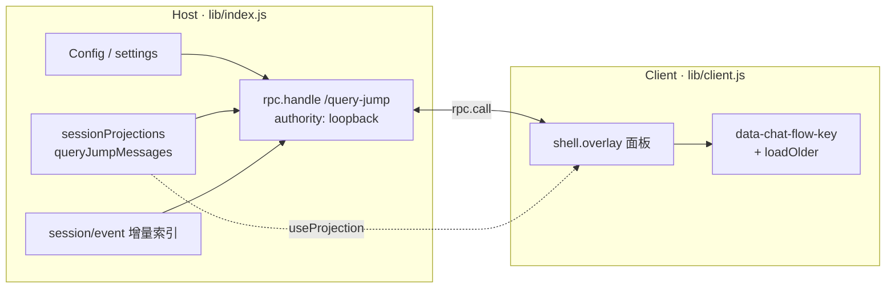

# dsh-query-jump

**DeepSeek Harness（DSH）会话 Query 定位插件**

在 WebUI 右侧提供常驻「用户提问」导航面板：只看真人 Query，一点即平滑跳回聊天位置并短暂高亮。不改 DSH 内核，可插拔安装。

<p align="center">
  
  
  
  
</p>

---

## 目录

- [为什么做这个插件](#为什么做这个插件)
- [功能一览](#功能一览)
- [效果示意](#效果示意)
- [架构概览](#架构概览)
- [快速开始](#快速开始)
- [使用说明](#使用说明)
- [配置项](#配置项)
- [项目结构](#项目结构)
- [开发与测试](#开发与测试)
- [与 Trajectory / 社区导航的对比](#与-trajectory--社区导航的对比)
- [边界与已知限制](#边界与已知限制)
- [设计文档](#设计文档)
- [许可证](#许可证)

---

## 为什么做这个插件

DSH 自带 **Trajectory（轨迹）** 能看完整事件流，但对「找回某次自己问过什么」并不友好：

| 痛点 | Trajectory | 本插件 |
| --- | --- | --- |
| 事件噪音 | 用户 / 模型 / 工具 / system 混在一起 | **只保留真实用户提问** |
| 跳转聊天 | 独立 Tab，**不能点回对话 DOM** | 点击列表 → **平滑滚动 + 高亮** |
| 入口成本 | 需要切换视图 | 右侧浮层，**对话页常驻** |

灵感来自通义千问等产品的会话导航：长对话里用「提问目录」快速定位，而不是在 Trajectory 里翻全量日志。

---

## 功能一览

| 能力 | 说明 |
| --- | --- |
| 用户 Query 列表 | 仅 `user/message` 且 `source.kind === 'user'`，过滤 inject / 工具 / 模型回复 |
| 一键跳转 | 通过 `data-chat-flow-key` 定位消息行，`scrollIntoView` + 约 1.2s 高亮 |
| 历史入窗 | 目标尚未渲染时，调用会话 `loadOlder()` 翻页后再跳 |
| 会话隔离 | 跟随当前会话；切换会话自动换列表 |
| 总开关 | **面板内勾选框**（主路径）；可选写入 settings；支持 Config 默认值 |
| 清空列表 | 只清插件侧 mask / 展示，**绝不删除原始会话消息** |
| 存储保护 | 单会话默认最多保留 **200** 条（可配） |
| 零外网 | Host↔Client 使用 loopback RPC；不新增端口、不对外请求 |
| 双通道列表 | 优先会话投影 `queryJumpMessages`；无投影时 RPC `list` 增量兜底 |

---

## 效果示意

```
┌─────────────────────────────────────────────────────────────┐
│  DSH WebUI                                                  │
│  ┌──────────────────────────────┐  ┌──────────────────────┐ │
│  │                              │  │ ☑ 会话 Query 定位    │ │
│  │   聊天区域                    │  │ [清空本会话列表]     │ │
│  │                              │  │──────────────────────│ │
│  │   ┌────────────────────┐     │  │ 如何配置沙箱策略…    │ │
│  │   │ 用户提问（高亮中）  │ ◀──┼──│ 帮我总结这段日志     │ │
│  │   └────────────────────┘     │  │ 再解释一下权限模型   │ │
│  │                              │  │ …                    │ │
│  └──────────────────────────────┘  └──────────────────────┘ │
└─────────────────────────────────────────────────────────────┘
         点击右侧条目 → 左侧对话平滑滚到对应消息
```

关闭总开关后，面板收成一条窄条，勾选即可重新启用（不依赖 Web 设置白名单）。

---

## 架构概览

本插件是标准的 **Cordis 双半包**：Node Host + Browser Client，经 DSH profile 的 `cordis.patch.yml` 挂入。



| 半边 | 职责 |
| --- | --- |
| **Host** | 折叠 / 采集用户消息；loopback RPC（`getConfig` / `setEnable` / `list` / `clearMask` / `getMask` / `ping`） |
| **Client** | 右浮层 UI；读投影或轮询 `list`；跳转与高亮；面板开关 |

---

## 快速开始

### 环境要求

- Node.js **≥ 20**
- 已安装 DSH CLI（`@deepseek-ai/dsh`），能运行 `dsh web`
- 建议从本机 `127.0.0.1` 访问 WebUI（RPC 为 loopback）

### 安装到 web profile

```bash
# 1. 进入仓库
cd dsh-query-jump

# 2. 安装依赖并构建
npm install
npm run build

# 3. 链入本机 profile（推荐：改源码后重启即可生效）
dsh plugin --profile web add link:.

# 也可：
# dsh plugin --profile web add ./dsh-query-jump
```

### 激活

1. **完全重启** `dsh web`（插件集合在进程启动时加载）
2. 浏览器打开 WebUI 并 **硬刷新**
3. 右侧应出现「会话 Query 定位」浮层；发几条用户消息后列表会追加

### 卸载

```bash
dsh plugin --profile web remove dsh-query-jump
```

重启 `dsh web` 后面板消失。

### 验证配置层是否挂上

```bash
dsh --profile web --dump-config
```

输出中应能看到本插件对应的 bundle / patch 层（id：`query-jump`）。

---

## 使用说明

| 操作 | 行为 |
| --- | --- |
| 发送用户消息 | 侧栏追加一条预览（截断显示，悬停看全文） |
| 点击某条 Query | 对话区滚到对应气泡并蓝色描边高亮约 1.2 秒 |
| 点击较早的历史 | 若消息未入窗，会先 `loadOlder` 再跳转 |
| 勾选 / 取消「启用」 | 关闭后停止采集（面板留窄条可再开）；开启后可继续查看已有索引 |
| 「清空本会话列表」 | 仅对本会话做展示屏蔽（mask），聊天记录不受影响 |
| 切换会话 | 列表自动换成当前会话内容 |

---

## 配置项

安装时由 `cordis.patch.yml` 写入默认配置，也可在 profile 中覆盖：

| 字段 | 类型 | 默认 | 说明 |
| --- | --- | --- | --- |
| `enable` | `boolean` | `true` | 功能总开关；面板勾选会通过 RPC 持久化（若 settings 可用） |
| `maxQuery` | `number` | `200` | 单会话最多保留条数，超出丢弃最早 |
| `includeSteering` | `boolean` | `false` | 预留：是否纳入 steering 类用户消息 |

```yaml
# cordis.patch.yml（摘要）
- insert:
  - id: query-jump
    name: dsh-query-jump
    config:
      enable: true
      maxQuery: 200
      includeSteering: false
```

> **关于 Web「设置 → 插件配置」**  
> 当前 DSH 对第三方 settings 命名空间有白名单限制，卡片可能不出现。日常请用 **面板内开关**；Host 仍会尝试 `settings.register('dsh-query-jump')` 做本机持久化。上游开放 `expose` 后可无缝挂到设置页。

---

## 项目结构

```
dsh-query-jump/
├── src/
│   ├── index.ts      # Host：投影 / 增量索引 / RPC / settings
│   ├── client.tsx    # Client：shell.overlay 面板与跳转
│   └── text.ts       # 纯函数：摘要、过滤、投影 apply（可单测）
├── lib/              # 构建产物（index.js + client.js）
├── test/             # node:test 单元测试
├── fh/               # 完整设计文档
├── build.mjs         # esbuild 双半构建（Client 含 __ModuleLoader__）
├── cordis.patch.yml  # profile bundle 补丁
├── package.json
└── README.md
```

---

## 开发与测试

```bash
npm install
npm run build    # 输出 lib/index.js、lib/client.js
npm test         # 过滤 / 摘要 / 去重 / maxQuery 等纯函数测试
```

本地联调建议：

1. `dsh plugin --profile web add link:.`
2. 改代码后 `npm run build`
3. 重启 `dsh web`（集合变更）或硬刷新（仅 client bundle 内容变更时通常足够）

---

## 与 Trajectory / 社区导航的对比

| 维度 | **QueryJump（本插件）** | DSH Trajectory | 社区 tick-rail 类导航 |
| --- | --- | --- | --- |
| UI 形态 | 右侧浮层 **文本列表** | 独立 Tab | 对话右缘短横线 |
| 内容 | 用户提问摘要 | 全量事件 | 用户消息 tick |
| 跳转聊天 DOM | 支持 | 不支持 | 支持 |
| 清空插件索引 | 支持（mask） | — | 通常无 |
| 总开关 | 面板内开关 | 无 | 视实现而定 |
| 定位场景 | 「我问过什么 → 点回去」 | 调试 / 审计全事件 | 快速 scrub 阅读位置 |

本插件与 tick-rail **可并存**（投影 key 为 `queryJumpMessages`，不占用他人 key）。

---

## 边界与已知限制

1. **DOM 契约**：依赖 `data-chat-flow-key` / `data-chat-flow-kind` / `data-conversation-scroll`；DSH 前端改版后可能需同步选择器。  
2. **过滤规则**：只收 `source.kind === 'user'` 的 `user/message`；plugin inject、工具通知等不会进列表。  
3. **窗口化历史**：超长会话需 `loadOlder`；若会话 API 不可用，仅能跳已入窗消息。  
4. **loopback**：非本机地址访问 WebUI 时面板会提示不可用（安全策略）。  
5. **busy 时序**：排队中的提问可能尚未落成 `user/message`，列表会略晚于输入框。  
6. **DSH 仍为 preview**：slot / RPC / 投影细节可能随版本微调。

---

## 设计文档

更完整的需求、校对结论、风险与测试矩阵见：

- [fh/dsh-query-jump设计文档.md](./fh/dsh‑query‑jump设计文档.md)

---

## 许可证

[MIT](./LICENSE) © dsh-query-jump contributors

---

<p align="center">
  <sub>Built for <a href="https://github.com/deepseek-ai/deepseek-harness">DeepSeek Harness</a> · Everything is a plugin.</sub>
</p>
